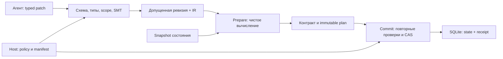

> Историческая спецификация из исходного проекта. Личные пути в этой публикационной копии заменены; original commit/blob IDs относятся к исходной локальной истории. [Происхождение публикации](../docs/publication.md).

# Минимальное ядро языка для агента: проверяемое резервирование v0

## 0. Метаданные

- Статус: EXEC завершён; пользователь подтвердил «Спеку подтверждаю». Локальный v0 реализован, conformance 29/29, 10 904 assertions, post-EXEC review PASS.
- Тип / профиль: `delivery-task`, `product-system-design`; масштаб large из-за нового языка и границы доверия, хотя предметная область намеренно мала.
- Владелец замысла: Kibnet. Автор рабочей спецификации: Codex.
- Центральный шаблон: `<user-home>/.codex/agents/templates/specs/_template.md`.
- Instruction stack: `creator-vibe-lens`, `model-behavior-baseline`, `tool-execution-baseline`, `collaboration-baseline`, `quest-governance`, `quest-mode`, `spec-linter`, `spec-rubric`, `review-loops`, `product-system-design`. Локальный override не найден.
- Целевой behavior baseline: семейство GPT-5.6 из центральных правил. Поверхность: Codex; точный effective model/reasoning не подтверждён доступными данными, для семантики языка значения не имеет.
- Eval baseline: локальная проверка AILANG и World (исторический локальный источник), 17 проб AILANG, 9 выбранных тестов World и 34 REST assertions; сравнение качества моделей ещё не выполнялось.
- Исходный замысел: пост о языках для агента (исторический локальный источник) и комментарии пользователя в текущем разговоре.
- Текущий workspace: `<private-knowledge-base>`, ветка `master`; до SPEC рабочее дерево чистое.
- Рабочая spec хранится здесь. Прототип создан отдельно в `<original-checkout>`, без создания remote и публикации. [Итог и evidence](<../REPORT.md>).
- SPEC-фаза изменяла только этот файл. После approval выполнена реализация в отдельной папке; копия актуальной spec включена в прототип. Ниже AS-IS и Post-SPEC Review сохраняют исторический контекст утверждения; текущий результат — в Post-EXEC Review.

## 1. Overview / Цель

Создать исполнимый эксперимент, в котором агент предлагает реализацию перехода состояния через ограниченный типизированный граф, а host самостоятельно решает, можно ли допустить программу и применить её результат. Первый сценарий — резервирование количества одного ресурса из доступного остатка.

Success means: допустимая программа резервирует 3 из 10 и получает 7; ошибки арифметики, нарушение фиксированного контракта, запрещённые полномочия, повтор события и устаревшая ревизия не приводят к непредусмотренной записи. Пользователь видит вычисленное объяснение изменения и свидетельства проверок.

Итог — спецификация с формальной моделью, протоколами и проверками, локальный CLI-прототип, эталонный интерпретатор графа, компилятор в IR, исполнитель IR, admission verifier, host с SQLite и воспроизводимые conformance-сценарии. Собственный компилятор в машинный код не нужен для первого эксперимента.

Stop rules: не расширять набор типов, операций, бизнес-сценариев и интеграций до прохождения критериев v0. Любое расхождение graph interpreter / IR interpreter / SMT блокирует допуск программы. После проверки утверждённого v0 и устранения review findings завершить локальный эксперимент.

## 2. Текущее состояние (AS-IS)

Своего проекта языка пока нет. В отдельной исследовательской папке сохранены закреплённые исходники и evidence AILANG v0.35.0 и World. Проверка выявила расхождение математического SMT Int и машинного int; runtime-контракты выключены по умолчанию; уже выполненные эффекты не откатываются при ложном ensures. Raw commit World проверяет собственный storage-контракт, но не обеспечивает обязательный admission языка и дедупликацию бизнес-событий.

Эти результаты относятся к проверенным версиям и маршрутам. Они обосновывают требования прототипа, но не являются аудитом всех возможностей этих проектов. В новом ядре не будет зависимости от AILANG или World; позднее можно проверять их как backend по тому же conformance-набору.

## 3. Проблема

Без единого защищённого договора между представлением программы, проверкой и применением результата агент может получить формальное «успешно», сохранив поведение, которое нарушает исходное ограничение. Нужно сделать этот договор явным и исполнимым на малом примере.

## 4. Цели дизайна

- Каноническая структура и закрытый словарь операций; каждый оператор имеет одну определённую семантику.
- Одинаковая арифметика в интерпретаторах и проверке; никаких неявных преобразований.
- Требования, политики, полномочия и admission-процедура находятся вне изменяемой агентом программы.
- Идентификатор сущности сохраняется при изменении её содержимого; ревизия содержимого меняется.
- Все изменения программы и состояния проходят через отдельные типизированные команды и атомарные проверки.
- Ошибки, результаты и человеческое объяснение выводятся из артефактов, а не из рассказа агента.
- Гарантии ограничены контрактом v0; преимущества для LLM остаются проверяемой гипотезой.

## 5. Non-Goals

Общий язык приложений; произвольные функции и рекурсия; циклы; float/decimal; строки и коллекции внутри вычислений; динамическая загрузка кода; сеть, shell, файлы пользователя и реальные платежи; внешние эффекты и их компенсация; конкурентная семантика внутри программы; миграции старых продуктов; собственный текстовый синтаксис; LLVM/Wasm/CLR backend; доказательство корректности solver/компилятора в proof assistant; benchmark LLM; публикация upstream issue, Git delivery или deploy.

Отсутствие внешних эффектов означает `EffectPlan=[]`, а не скрытый IO в ядре. Локальная запись состояния принадлежит host и требует конкретного разрешения `StateWrite(resourceId)`.

## 6. Предлагаемое решение (TO-BE)

### 6.1 Распределение ответственности

| Компонент будущего прототипа | Ответственность |
| --- | --- |
| `Kernel.Core/Model`, `Codec`, `Validation` | Типизированный граф, строгий JSON transport, канонизация, типы и зависимости |
| `Kernel.Core/Reference` | Эталонное вычисление графа через математические целые и явные проверки диапазона |
| `Kernel.Core/Lowering`, `Ir` | Детерминированная компиляция в линейный IR и отдельный исполнитель на checked I64 |
| `Kernel.Core/Verification` | Генерация SMT obligations, запуск solver и проверка структуры результата |
| `Kernel.Host/Policy`, `Patches`, `Admission` | Host-owned профиль, полномочия редактирования, атомарное изменение и активация программы |
| `Kernel.Host/Execution`, `Store`, `Replay` | Prepare/commit, receipts, CAS, атомарность SQLite и replay без записи |
| `Kernel.Cli` | Команды, JSON outcomes и русская человеческая проекция |
| `Kernel.Conformance` | Исполняемый набор сценариев с ненулевым exit при провале, independent oracle и fault injection |

Это модули по ответственности, а не требование создать отдельную сборку для каждого. Достаточно Core, Host, CLI и Conformance. Предлагаемый стек: C# / .NET 10, SQLite через Microsoft.Data.Sqlite, Z3 CLI с SMT-LIB. На этой машине подтверждён SDK 10.0.400; он закрепляется в будущем `global.json`. Точные зависимости и бинарник Z3 фиксируются версиями и digest в EXEC, без floating/latest и без изменения глобальной установки.

### 6.2 Детальный дизайн



#### 6.2.1 Граница доверия

Агенту доступны описание протокола, read-only snapshot и методы `ProposePatch`, `Prepare`, `Commit`, `Replay`, `Explain`. Он не получает интерфейс raw SQLite, изменение Policy/ContractManifest, запуск произвольного C# или выбор verifier flags. Host получает эти данные из собственного конфигурационного каталога и не принимает их из patch.

Trusted computing base: parser/validator, canonicalizer, интерпретаторы, SMT encoder и solver, admission/commit-код, SQLite, платформа и защищённая конфигурация host. `verified` означает «запрос к выбранному solver не нашёл контрпример в определённой модели», а не механизированное доказательство корректности всей TCB.

Этот прототип защищает от некорректной программы и запросов через его API. Агент с произвольным доступом к файлам/процессу host находится вне модели угроз: одна библиотека не изолирует сама себя от администратора машины. В тестах агент представлен клиентом закрытого API; отдельная OS-песочница для живого coding agent — следующий эксперимент.

#### 6.2.2 Исходная структура и нотация

Источник — конечный типизированный DAG единственной функции `reserve`, представленный JSON-объектом. JSON lexer/parser берётся из стандартной библиотеки; отдельный lexer нового языка не нужен. Поверх него обязателен строгий schema validator: неизвестные и повторяющиеся поля, неизвестные enum/opcode, неверные типы и отсутствующие поля отклоняются.

Обязательные поля Program: `schemaVersion`, `programId`, `profileId`, `nodes`, `outputs`. `schemaVersion="kernel.v0"`; `programId` и `profileId` должны точно соответствовать host-профилю. `nodes` — множество узлов с уникальными ID. `outputs` — ровно три ссылки `accepted`, `available`, `reserved`.

Нотация структуры (описание схемы, не второй исходный синтаксис):

```text
Node = Input(id, fieldId, type)
     | ConstI64(id, decimalString)
     | ConstBool(id, boolean)
     | Unary(id, opcode, argId, type)
     | Binary(id, opcode, leftId, rightId, type)
     | Select(id, conditionId, whenTrueId, whenFalseId, type)
Program = (schemaVersion, programId, profileId, Set<Node>, Outputs)
```

Wire-формы: у всех узлов ровно `id,op,type,args`; `args` — массив ID с порядком операндов. Только `input` дополнительно содержит `fieldId`, только `i64.const`/`bool.const` — `value`; лишние поля запрещены. У input/const args пуст. ID — ASCII `[a-z][a-z0-9._-]{0,63}`. В v0 ID выдаёт клиент; host проверяет уникальность, scope и запрет повторного использования удалённых ID.

Числа языка передаются **десятичными строками**: `0` или `-?[1-9][0-9]*`, без `+`, `-0`, экспоненты и пробелов, в диапазоне I64. JSON numbers не принимаются вместо I64. Bool — JSON true/false. Transport разрешает whitespace и любой порядок полей/узлов; перед hashing host строит единственную canonical encoding: UTF-8 без BOM/whitespace, ключи объектов в ASCII-порядке, nodes по ID, args в исходном семантическом порядке, обязательные поля присутствуют. Все строки v0 — ограниченный ASCII, escape-формы transport декодируются до проверки и кодируются минимально; контрольные символы запрещены. Дубликаты ключей отклоняются до построения dictionary.

`ProgramRevision = SHA256("kernel.v0/program\n" || canonicalProgramBytes)`. Ревизия узла аналогична с domain `kernel.v0/node`. Строка digest — 64 lowercase hex. Hash не заменяет валидацию и не делает семантически эквивалентные программы одинаковыми. Например, `a+b` и `b+a` могут иметь разные графы и ревизии. Каноничность здесь относится к одному размеченному графу, а не к единственному выражению любой математической функции.

Общее правило content-addressed артефактов: `H(kind,payload)=SHA256(UTF8("kernel.v0/"+kind+"\n") || C(payload))`, где C использует те же правила ключей/UTF-8/массивов, что Program; технические целые в этих payload также decimal strings, Bool — JSON boolean, null явный. Domain kinds закрыты: `program,node,outputs,patch,event,ir,policy,manifest,admission,input,output,trace,receipt,state,genesis`. Payload не содержит собственного digest. `event` — точный Event из 6.2.9; `ir` — semanticsVersion + programRevision + instruction array + outputs; `outputs` — output map; `patch` — полный Patch, operations в порядке transport. Policy и manifest hashes охватывают все semantic/config fields, включая ACL, limits и contract IDs. Операционные времена, свободный reason и actor display name не входят в эти hashes; provenance хранится отдельным record, связанным digest. `receipt` включает нормативные поля из 6.2.10; `state`/`genesis` — payload из 6.2.9. Изменение сериализации требует другой schema/semantics version, а не тихого пересчёта старых hashes.

Все узлы должны быть достижимы из outputs; лишний мёртвый код, циклы и dangling references запрещены. После проверки DAG задаётся единственный топологический порядок: среди готовых узлов выбирается минимальный ASCII ID. Ссылки на файлы и номера строк не участвуют в семантике.

#### 6.2.3 Типы, операции, порядок вычисления

Типы выражений v0 — `I64`, `Bool`. Запись входа и выхода фиксируется профилем; внутри графа нет универсальных records, nullable, исключений или implicit casts.

| Opcode | Сигнатура | Правило |
| --- | --- | --- |
| `input` | fieldId → I64 | Только `state.available` и `event.quantity` |
| `i64.const`, `bool.const` | literal → соответствующий тип | Строгое значение |
| `i64.add_checked`, `i64.sub_checked` | I64 × I64 → I64 | Ошибка при выходе результата за диапазон |
| `i64.le`, `i64.eq` | I64 × I64 → Bool | Знаковое сравнение |
| `bool.not` | Bool → Bool | Отрицание |
| `bool.and`, `bool.or` | Bool × Bool → Bool | Строгие операции без short-circuit |
| `select` | Bool × T × T → T | T только I64 или Bool; оба значения уже вычислены |

Все достижимые узлы вычисляются **ровно один раз** в каноническом топологическом порядке. `select` не является ленивым `if`: overflow в невыбранном операнде всё равно ошибка. Это сознательное ограничение v0, уменьшающее сложность семантики, анализа и metering. Оно явно показывается агенту.

`I64 = {n ∈ Z | -2^63 ≤ n ≤ 2^63-1}`. Для a+b и a-b сначала определяется точный математический результат z; при z вне I64 возвращается `ArithmeticOverflow(nodeId)`, без wraparound/saturation. Эталонный interpreter использует BigInteger + bounds; IR interpreter — `checked` непосредственно внутри реализации каждого арифметического opcode, с переводом OverflowException в ту же ошибку. Сам по себе checked вокруг вызова helper не распространяется на его тело: это подтверждает [документация C#](https://learn.microsoft.com/en-us/dotnet/csharp/language-reference/statements/checked-and-unchecked).

`Eval(G, input, fuel) -> Value(output, trace, usedFuel) | Error(code,nodeId,usedFuel)`. Одна попытка вычисления узла стоит 1 fuel. Перед узлом проверяется остаток, затем единица списывается; переполнившийся узел уже учтён. При исчерпании следующий узел не выполняется. В successful execution `usedFuel = nodeCount`; opcode-cost не зависит от machine latency. В trace — ID, opcode, typed operands/result или ошибка; это данные тестового ресурса, не произвольные пользовательские секреты.

#### 6.2.4 Защищённый профиль Reserve

Host manifest закрепляет schema, поля, ожидаемые outputs, контрактные ID, обязательность проверок и resourceId. Входной инвариант: `available >= 0`; предусловие события: `quantity > 0`; оба входа I64. Невалидный stock означает `StateInvariantFailed`, не новый допустимый домен; неверный quantity — `PreconditionFailed`, до eval и без потребления eventId.

Обязательный контракт `reserve.v0`:

```text
если quantity <= old.available:
  accepted = true
  reserved = quantity
  new.available = old.available - quantity
иначе:
  accepted = false
  reserved = 0
  new.available = old.available
во всех случаях: new.available >= 0
```

`reserved` — количество этого события, не накопленный остаток. Host самостоятельно сравнивает выход с этим контрактом до commit. Контракт не принимается от агента; граф не может сузить предусловие до `false`, удалить ветку или объявить `ensures true`. Здесь цель представлена фиксированным проверяемым доменным контрактом; извлечение правильной цели из естественного языка остаётся ответственностью человека.

Предикаты manifest — фиксированная тотальная математическая логика над целыми и Bool, отдельно от программных checked-opcodes. Runtime contract checker использует BigInteger: даже некорректный выход не должен вызвать переполнение внутри самой проверки. Именованные output-инварианты: `available >= 0`, `reserved >= 0`, `available + reserved = old.available`. Они дополняют точные ветки контракта, не заменяют их.

Минимальная корректная программа:

```json
{
  "schemaVersion":"kernel.v0",
  "programId":"reserve",
  "profileId":"reserve.v0",
  "nodes":[
    {"id":"n.available","op":"input","type":"I64","args":[],"fieldId":"state.available"},
    {"id":"n.quantity","op":"input","type":"I64","args":[],"fieldId":"event.quantity"},
    {"id":"n.zero","op":"i64.const","type":"I64","args":[],"value":"0"},
    {"id":"n.enough","op":"i64.le","type":"Bool","args":["n.quantity","n.available"]},
    {"id":"n.debit","op":"select","type":"I64","args":["n.enough","n.quantity","n.zero"]},
    {"id":"n.remaining","op":"i64.sub_checked","type":"I64","args":["n.available","n.debit"]}
  ],
  "outputs":{"accepted":"n.enough","available":"n.remaining","reserved":"n.debit"}
}
```

Это transport example; canonical bytes сортируют узлы и ключи. `debit` выбирается перед вычитанием, поэтому строгий select не вычисляет потенциально недопустимое альтернативное вычитание.

#### 6.2.5 Формальная проверка и admission

Каждое admission состоит из parse/schema, DAG/type/scope, resource limits, lowering/IR validation, обязательного SMT и сохранения immutable artifacts. Все стадии возвращают собственный статус; exit 0 дочернего процесса не заменяет проверку результата. Admission для неизвестного/неполного manifest запрещён.

SMT использует QF_LIA: математические Int с явно ограниченными **входами**, Bool, +/-, сравнение и ite. Как отмечает [руководство Z3](https://microsoft.github.io/z3guide/docs/theories/Arithmetic/), математический Int не равен машинному целому; ограничения результата должны проверяться отдельно.

Обозначим D — диапазоны входов и фиксированное pre/invariant. Каждый узел имеет математическое значение v и флаг defined. Для арифметики defined включает defined зависимостей и `Min <= z <= Max`; для select defined включает condition **и оба** operands. Выход defined только если определены все достижимые узлы. Формируется запрос контрпримера:

```text
D ∧ (NOT AllDefined OR NOT ReservePostcondition)
```

Диапазон промежуточного результата **нельзя добавлять как assumption**, исключающую overflow-вход из D. Все промежуточные mathematical values сохраняются в формуле, даже когда результат вне I64; AllDefined фиксирует ошибку. Дополнительно проверяется существование D (`sat`), чтобы невозможный профиль не дал вакуумный успех.

- `unsat` основного запроса → `verified`, если D непуст и все обязательные obligations сформированы.
- `sat` → `counterexample`: значения входов извлекаются точно, затем повторяются в reference interpreter. Если witness не воспроизводится, `VerifierMismatch`, admission запрещён.
- `unknown`, timeout, crash, missing status/обязательство, unsupported opcode, пустой домен → отказ с соответствующим структурированным кодом. Ни один не трактуется как `verified`.

Witness не обязан быть одинаковым при разных версиях solver. Детерминированность исполнения программы не означает постоянство времени solver или выбора контрпримера. В receipt проверки фиксируются `semanticsVersion`, program/IR/policy/manifest digest, encoder/interpreter versions, solver version+binary digest, query digest и статусы каждого обязательства. Изменение любого элемента требует нового admission; агент не передаёт `verified=true` и не выбирает solver timeout.

Все runtime-контракты проверяются и после статического verified: несовпадение прекращает применение и отмечает `VerifierMismatch` как дефект TCB. Для проверки malformed/непроверенных программ есть внутренний test harness; публичный Prepare их не запускает.

#### 6.2.6 Компиляция в промежуточное представление

Компилятор последовательно заменяет DAG линейной SSA-последовательностью `Instruction(destinationIndex, originNodeId, opcode, operandIndices, type, literalOrField)` и map outputs→indices. Индексы назначаются по каноническому топологическому порядку. Optimizations, constant folding, DCE и переписывание выражений в v0 отсутствуют: точное сопоставление ID и fuel важнее скорости.

IR — производный артефакт, принимаемый только из доверенного lowering того же program revision. ValidateIR проверяет opcode, типы, арности, индексы только на предыдущие инструкции, unique destinations и покрытие outputs. IR можно экспортировать для просмотра, но agent не может загрузить произвольный IR для commit.

Conformance сравнивает reference graph interpreter и IR interpreter по выходу либо error code/nodeId, а также fuel и trace. В production-пути v0 используется IR interpreter, контракт проверяется host; reference нужен для независимого вычислительного oracle, проверки witness и replay. Это практическая проверка согласованности, не универсальное доказательство корректности lowering.

#### 6.2.7 Типизированные изменения программы

Patch содержит `schemaVersion,patchId,programId,baseProgramRevision,expectedPolicyRevision,operations`. Операции — `AddNode(node)`, `ReplaceNode(nodeId,expectedNodeRevision,node)`, `RemoveNode(nodeId,expectedNodeRevision)`, `SetOutputs(expectedOutputsDigest,outputs)`. Replace сохраняет ID. Повторные операции на одном ID в одном patch запрещены; SetOutputs не более одного. Revision форматы проверяются как SHA-256 hex; patch/event IDs — как ID выше.

Host выдаёт `EditScope`: набор существующих IDs, разрешение менять outputs и разрешённый prefix для AddNode. Удалённый ID навсегда tombstoned внутри programId; откат не оживляет его. Поля schema/profile/programId, input field whitelist, типы интерфейса, manifest и policy через patch не меняются. Новые узлы могут использовать только существующие разрешённые операции; добавление `http.send` даёт `UnsupportedOpcode`.

Порядок: parse → permissions → base/node revisions → построить candidate целиком в памяти → проверить итоговый граф/контракт и скомпилировать → SMT admission → короткая транзакция с повторной проверкой полного trust snapshot (active program/policy/manifest, caller ACL/EditScope, semantics/TCB identity) и atomic store+activation. Промежуточные dangling references внутри batch допустимы, в итоговом графе — нет. При stale после долгой проверки: `ProgramConflict`, `PolicyChanged` или `AdmissionInvalidated`, candidate не активируется; сохранять admission как актуальное для иного manifest запрещено.

`patchId` scoped к programId; host хранит canonical patch digest и receipt принятого patch атомарно с активацией. Точный повтор возвращает исходный receipt до stale-check; тот же patchId с другим содержимым — `PatchIdConflict`. Проверка текущих прав клиента выполняется до выдачи receipt. Неуспешные patches не занимают patchId. Если candidate bytes равны active bytes, возвращается `NoChange`, без изменения active revision; durable receipt **обязателен** и записывается в той же административной транзакции. Повтор NoChange после другого patch или рестарта возвращает исходный receipt, другой payload с тем же patchId даёт конфликт.

#### 6.2.8 Политика ресурсов и разрешений

Host policy задаёт concrete resourceId, EditScope, capability `StateWrite(resourceId)`, обязательные проверки и пределы. Начальные v0 limits: transport ≤64 KiB, JSON depth ≤32, nodes ≤128, patch operations ≤256, admission solver ≤5 s на obligation, общий admission watchdog ≤15 s, eval fuel ≤128, runtime worker watchdog ≤2 s, commit lock wait ≤2 s. Test policies с меньшим fuel принадлежат harness, не агенту. Пакет с количеством nodes > fuel отклоняется admission как `BudgetExceeded`; внутренний meter проверяется отдельно на границе каждого узла.

Fuel детерминирован, wall-clock watchdog — операционный предел с возможным отказом в разное время на разных машинах. Watchdog прерывает worker до передачи результата на commit; поздний результат отвергается. Не обещаются лимит RAM/CPU на уровне OS или денежный бюджет: платные/внешние вызовы в v0 отсутствуют, `externalCalls=0`. SQLite commit может закончиться до потери ответа; такой случай разрешается повтором по eventId, а не предположением об откате.

#### 6.2.9 Prepare, commit и идемпотентность

Существуют разные версии: `ProgramRevision` — hash графа, `PolicyRevision`/`ManifestRevision` — hash защищённых требований, `StateRevision` — hash журнала переходов конкретного resource. Смена программы не изменяет бизнес-остаток; commit после смены active program не применяет старый план.

Event: `eventId,resourceId,kind="reserve",quantity:I64`. EventDigest включает эти поля; expected revisions входят в execution envelope, а не в идентичность бизнес-события. Это позволяет повторять тот же event после перечитывания stale state. Receipt scope — `(resourceId,eventId)`.

`Prepare(event,expectedStateRevision,expectedProgramRevision,expectedPolicyRevision)`:

1. Проверить transport и текущие read/execute права на resource. До выполнения или раскрытия receipt проверить, что client имеет доступ.
2. Найти committed receipt по `(resourceId,eventId)`. При совпадении event digest вернуть его как `AlreadyCommitted` даже если expected revisions устарели. При несовпадении — `EventIdConflict`. Не запускать программу и не создавать новый резерв.
3. Прочитать `(resourceId,stateRevision,available,activeProgramRevision,policyRevision,manifestRevision)` в одной согласованной read transaction. Проверить ожидаемые active revisions, наличие admission для точного manifest/TCB, входной invariant/precondition и capability. Раздельные несогласованные чтения stock и revision запрещены.
4. Вычислить output из snapshot, проверить host-контракт и все resource limits. EffectPlan обязан быть пустым.
5. Создать host-owned immutable PreparedRecord: exact event/input/program/IR/policy/manifest digests, base state revision, result, fuel, verification reference и computed change summary. Клиент получает opaque prepareId и preview. Prepare не меняет бизнес-состояние и не занимает eventId.

`Commit(prepareId)` принимает только выданный host plan; клиентские newState/effectPlan/verified не являются полями этого API. Prepared records в v0 находятся в памяти host, ограничены 128 незавершёнными записями; после перезапуска или вытеснения нужен новый Prepare. Вытеснять только oldest uncommitted prepare; это операционный отказ `PrepareExpired`, не изменение результата программы. После завершённого commit запись можно удалить из памяти. Повтор по утраченному prepareId не сообщает «не записано»: клиент вызывает Prepare с исходным event и получает durable receipt, если commit состоялся. Идемпотентность определяется бизнес-событием, а не временем жизни token.

PreparedRecord привязан к caller principal, process epoch и resource. Известный token чужого caller не даёт доступ к плану или receipt. Для commit host захватывает immutable record из registry; eviction не изменяет уже захваченные bytes. Два одновременных Commit одного token могут захватить один record, но сериализованная транзакция второго возвращает receipt первого. Сохранённый input связан с baseStateRevision и event digest; output/digest клиентом не заменяются. Active policy/manifest/program и caller ACL/EditScope сохраняются в этой же SQLite и меняются trusted admin/test path под тем же writer lock. Authority snapshot неизменен до завершения транзакции. В v0 нет hot reload из файла во время commit. TCB/solver/semantics не заменяются в работающем процессе: обновление требует нового host epoch, уничтожает prepared cache и инвалидирует старый admission до повторной проверки.

Под SQLite `BEGIN IMMEDIATE` выполняются:

1. Текущая авторизация resource и lookup существующего receipt; точный повтор возвращает прежнее решение, другой digest — `EventIdConflict`.
2. Проверка preparedRecord provenance, active program/policy/manifest/TCB и base state revision. Дополнительно сохранённый state input должен точно совпадать с текущими `(resourceId,revision,available)`, а event — с сохранённым event digest. Несовпадение — `PolicyChanged`, `ProgramChanged`, `StateConflict`, `PreparedInputMismatch` или `AdmissionInvalidated`, без записи.
3. Проверка нового состояния и fixed contract по сохранённому input/output, capability `StateWrite(resourceId)` и отсутствия эффектов.
4. В одной транзакции: сохранить state revision, новый stock, event digest + immutable receipt, canonical input/output, trace/fuel и ссылки на все artifacts для replay. Unique constraint `(resourceId,eventId)` остаётся последней защитой. При любой ошибке явно rollback всей транзакции.
5. Ответ `Committed` только после успешного COMMIT; неопределённый исход возвращает `OutcomeUnknown`, а не `NotCommitted`. После неопределённого исхода/потери ответа клиент повторяет Prepare с тем же event, host читает receipt. Не запускать обработчик с новым eventId автоматически. Историческая stateRevision в возвращённом receipt явно названа `committedStateRevision`, она не выдается за текущий head.

SQLite обеспечивает один одновременный writer; `BEGIN IMMEDIATE` может вернуть BUSY, а некоторые ошибки не откатывают автоматически всю транзакцию. Поэтому протокол задаёт явный rollback и проверку состояния соединения. Основание — [официальное описание транзакций SQLite](https://www.sqlite.org/lang_transaction.html).

Отказ по недостатку остатка (`accepted=false`) — **успешно принятое бизнес-решение**: записывается receipt, state revision меняется, stock остаётся прежним. Ошибка input/контракта/бюджета — не committed decision, eventId свободен для исправленного запроса. В v0 receipts не удаляются: иначе повтор старого event мог бы изменить state.

`StateRevision = H("state",{resourceId,previousRevision,eventDigest,programRevision,policyRevision,manifestRevision,output})`; genesis = `H("genesis",{resourceId,initialAvailable})`. В revision и replay-comparison не входят время стены, PID и latency. Даже denied business decision меняет hash, потому что новый eventId входит в eventDigest; повтор того же event не создаёт новую запись.

#### 6.2.10 Replay, ошибки и человеческая проекция

Нормативный receipt payload: `resourceId,event,eventDigest,previousStateRevision,committedStateRevision,inputRef,outputRef,programRef,irRef,policyRef,manifestRef,admissionRef,semanticsVersion,runtimeIdentity,fuelUsed,fuelLimit,traceRef`. Все Ref — content hashes реально сохранённых artifacts; runtimeIdentity фиксирует interpreter/encoder/solver identities из admission. `receiptId = H("receipt",payload)` возвращается отдельно, не включается в собственный payload. Input включает pre-state stock/revision/resource и Event; output — exact Reserve record. Trace хранится как canonical массив `{nodeId,opcode,operands,value}`; успешный receipt не содержит runtime error. IR trace нормализуется к originNodeId, а не к индексам, чтобы совпадать с reference trace. Отдельный operational log не участвует в сравнении.

Replay(receiptId) проверяет current read authorization, hashes receipt и всех artifacts, наличие predecessor/genesis, event digest и точное соответствие сохранённого input состоянию предыдущей ревизии. Затем загружает исторические canonical program/IR/policy/manifest и версии семантики, повторяет чистый расчёт с **историческим fuelLimit** и сравнивает output/trace/fuel. Пересчитывает committedStateRevision и сверяет с receipt и transition row. Переход к policy «на сегодня» изменил бы смысл replay и запрещён; текущие operator read rights всё равно обязательны.

Replay не вызывает Commit и не обращается наружу. Нет artifact/predecessor/совместимого interpreter → `ReplayUnavailable`; content/link/computation mismatch → `ReplayMismatch`, без попытки выполнить заново живое действие. Режим verify replay с reference interpreter обязателен. Byte-identical promise относится к canonical semantic output, не к operational log или тексту solver. Это проверка целостности в доверенном локальном хранилище, не криптографическая защита от администратора, переписавшего все bytes и hashes.

Общий Error envelope: `schemaVersion,stage,code,entityId|null,programRevision|null,stateRevision|null,policyRevision|null,details,witness|null,allowedRepairs`. Поля не пропускаются. details — типизированный record для code, а не произвольная строка; integer witnesses — decimal strings. Диагностики сортируются stage→entityId→code; deterministic interpreter выдаёт первую ошибку по порядку eval. Version/tool/timeout metadata находятся отдельно.

`allowedRepairs` вычисляет host: `RetryWithFreshSnapshot`, `EditAllowedNodes`, `UseNewEventIdForDifferentIntent`, `AskOwnerToChangePolicy`; для конкретной ошибки может быть пусто. Подсказки не дают полномочий: никаких автоматических «добавь cap», «отключи контракт», «увеличь бюджет». AskOwner — сообщение, не доступный агенту mutation API. Свободный `reason` агента можно сохранять как untrusted provenance; он не меняет acceptance.

Человеческая проекция строится из diff графа, permissions, proof statuses и prepared/committed receipt. Пример output:

```text
Ресурс item-001. Событие evt-001. Резерв: 3. Остаток: 10 → 7.
Изменение программы: отсутствует; используется допущенная ревизия reserve.
Контракт reserve.v0: проверен. Внешние действия: 0. Вычисление: 6/128.
Состояние: подготовлено, запись ещё не выполнена.
```

Последняя строка меняется на «Записано; ревизия …» только по committed receipt. Здесь нет визуального UI/layout; отдельные wireframe/video не применимы. Text projection и JSON покрываются golden checks; формулировка «проверен» сопровождается профилем/версиями и границами guarantee из этой SPEC.

### 6.3 User-Observable Scenarios

| Scenario | Действие | Ожидаемый видимый результат | Evidence | AC |
| --- | --- | --- | --- | --- |
| S1 | Запустить demo: stock10, qty3, затем retry | 7 и один receipt; retry не списывает ещё 3 | JSON + DB snapshot | AC6, AC7 |
| S2 | Предложить graph с add вместо sub | Counterexample; active revision прежняя | Witness + replay в reference | AC3, AC5 |
| S3 | Попробовать изменить policy/чужой ID/добавить IO | Конкретный отказ, без новой программы/записи | Structured errors + hashes | AC4, AC5 |
| S4 | Подготовить два разных event на одной ревизии | Первый committed, второй StateConflict; новый prepare допускается | DB rows + receipts | AC7 |
| S5 | Снизить fuel доверенным test profile | Admission отказ; внутренний eval не выполняет лишний node | Meter trace | AC8 |
| S6 | Replay после рестарта host | Тот же semantic output, stock/receipts не меняются | Before/after DB + replay output | AC9 |
| S7 | Прочесть Explain перед commit | Видны изменения, cap scope, статус и пустой effect plan | Golden projection | AC10 |

### 6.4 State / Interaction Matrix

| State | Trigger | Result | Error/concurrency |
| --- | --- | --- | --- |
| Program active P0 | Valid patch → checked P1 | Atomic active P1 | Drift during solver: P0/current stays active |
| Snapshot S0 | Prepare E1 | In-memory plan, S0 unchanged | Invalid/budget/proof/cap: no plan |
| Prepared E1 on S0 | Commit | S1 + receipt atomically | Stale/changed policy: no write |
| Committed E1 | Same digest retry | Original receipt | Changed payload: EventIdConflict |
| Prepared plan | Host restart/eviction | PrepareExpired | Re-prepare same uncommitted event |
| No stock for qty | Commit rejected business outcome | Receipt + new revision, stock unchanged | Exact retry returns this rejection |
| Transaction open | Inject write error / process stop before commit | Reopen sees previous committed state | After commit before reply: receipt resolves ambiguity |

### 6.5 Decision Ledger

| Decision | Owner | Выбранное | Confidence | Риск допущения | Needs user before EXEC |
| --- | --- | --- | ---: | --- | --- |
| Область прототипа | agent | Один resource, Reserve, пустые effects | 0.95 | Не показывает общую выразительность | Нет |
| Числа | agent | I64 checked; BigInteger reference; SMT range obligations | 0.96 | Уже математических integers, проще сопоставление | Нет |
| Семантика ветвления | agent | Eager DAG и strict select | 0.90 | Часть привычных программ отклоняется | Нет |
| Формат | agent | Строгий JSON DAG и typed patches | 0.94 | JSON многословен для LLM | Нет |
| Стек | agent | C#/.NET10, SQLite, Z3 CLI | 0.89 | Две платформенные зависимости | Нет |
| Дедупликация | agent | EventId+digest, receipt lookup перед stale | 0.96 | Хранение receipts растёт | Нет |
| Место кода | agent | Отдельная папка Documents/Codex | 0.96 | Позднее перенос в repo | Нет |
| Общие backend и внешний IO | agent | За пределами v0 | 0.96 | Пока не демонстрируем сетевые эффекты | Нет |

Эти defaults входят в предмет утверждения SPEC; отдельного блокирующего пользовательского выбора нет.

### 6.6 Runtime / Config / Data Contract Matrix

| Область | Source of truth | Решение | Compatibility | Verification |
| --- | --- | --- | --- | --- |
| Правила / cap / limits | Host Policy + manifest | Agent read-only | Любое изменение инвалидирует admission/prepare | Policy mutation tests |
| Source identity | Canonical Program | Stable ID + content hash | schemaVersion exact | Golden bytes/hashes |
| Execution | semanticsVersion + pinned tools | No flags disabling checks | Unknown version refused | Drift test |
| State | SQLite current revision | Commit-only write | New local DB schema v0 | CAS + fault injection |
| Event identity | resourceId,eventId,digest | Durable unique receipt | No pruning in v0 | Retry/restart tests |
| Replay | Immutable artifacts + receipt | No live fallback | Missing old runtime → explicit refusal | Replay gap test |

## 7. Бизнес-правила / Алгоритмы

Нормативная семантика определена в 6.2.3–6.2.5; точный порядок транзакционных проверок — в 6.2.7 и 6.2.9. Основные инварианты: active program имеет актуальный admission; stock ≥0; один committed receipt на resource/event; receipt/state/artifact references фиксируются атомарно; неподходящая revision не пишет; agent не меняет защищённые требования.

Гарантия по всем допустимым входам условна корректностью TCB и соответствием admission тому же графу/manifest. Для конкретного commit host дополнительно проверяет фактический output. Внешние эффекты не исполняются даже при «успешной» программе.

## 8. Точки интеграции и триггеры

Публичный интерфейс — закрытый request/response protocol версии v0. CLI читает запросы из файла/stdin и передаёт trusted host без shell-интерполяции. Методы: `Snapshot(resourceId)`, `ProposePatch(patch)`, `Prepare(envelope)`, `Commit(prepareId)`, `Replay(receiptId)`, `Explain(artifactId)`. Test-only init создаёт genesis resource item-001 со stock10 и начальную программу, прошедшую тот же admission, что последующие patches; agent не вызывает init/reset. Новый host epoch отменяет незавершённые admission/patch операции прошлого epoch, поздний ответ worker не активирует программу.

Подпись метода не является capability: host берёт caller principal из транспорта своего процесса, не из `principal` в JSON. В локальном demo harness создаёт клиента с фиксированными правами. Удалённая аутентификация не входит в v0.

Общая authorization matrix применяется **до раскрытия existence, hashes, witness или receipt**: Snapshot требует `ReadResource`; Prepare — `ReadResource+ExecuteResource` (новый plan дополнительно `StateWrite`); Commit — owner principal token + `ReadResource+ExecuteResource` (новая запись дополнительно `StateWrite`); Replay — `ReadResource+ReplayResource`; Explain — `ReadResource` для каждого связанного resource и `ReadProgram` для program artifact; ProposePatch — `ReadProgram+EditScope`. Missing/unknown resource, чужой artifact и отсутствие прав дают единый `AccessDenied` без внутренних деталей. Все ошибки и allowedRepairs фильтруются по той же видимости. Точный повтор receipt также требует текущих read rights; знание ID не является разрешением. Trusted harness проверяет отзыв доступа через каждый read-метод, не только Commit.

## 9. Изменения модели данных / состояния

Предлагаются SQLite tables: immutable `programs`, `admissions`, `artifacts`, `patch_receipts`, `retired_node_ids`, `resources`, `transitions`, `event_receipts`. State и receipts связаны FOREIGN KEY, ограничения включены и проверяются при startup. UNIQUE на `(resourceId,eventId)` и `(programId,patchId)`. Политика/manifest как immutable artifacts; active references меняются только trusted host setup/admin path, не агентом.

PreparedRecord transient; state/receipt/artifacts persistent. Время/actor metadata сохраняются отдельно от семантических hashes. Будущий storage/schema test проверяет reload active references и отсутствие dangling evidence. В v0 один демонстрационный ресурс и один writer host; concurrent clients всё равно проходят CAS.

## 10. Миграция / Rollout / Rollback

Создаётся новая disposable DB; существующие данные Obsidian/AILANG/World не мигрируют. Версия schema несовместима → отказ, без автоматического destructive reset. Program rollback — новый проверенный patch к прежнему смыслу, с текущей base revision; tombstoned IDs не оживляются.

До commit отказ не меняет бизнес-состояние. После commit нельзя «откатить» запись удалением receipt: для будущего продукта потребуется новое компенсирующее бизнес-событие. В v0 compensation вне scope; повторный genesis разрешён только harness в новой DB. Ошибки записи вызывают rollback полной транзакции; process kill проверяется на конкретных точках, power-loss guarantee не объявляется.

## 11. Тестирование и критерии приёмки

Следующие проверки — **план EXEC, ещё не выполнены**. В текущей фазе проверяется полнота SPEC, пример JSON и соответствие дизайна обнаруженным рискам.

### Acceptance-to-Test Matrix

| AC | Automated test / точный ожидаемый результат | Evidence | Итог EXEC |
| --- | --- | --- | --- |
| AC1 Структура/каноничность | Порядок keys/nodes и whitespace не меняют hash; duplicate keys, -0, JSON number вместо I64, dangling/cycle/dead nodes, неизвестные поля/типы отвергаются | canonical golden + negative JSON | PASS; cases в REPORT.md |
| AC2 Числа | Min/Max/0/1/-1: Max+1 и Min-1 → ArithmeticOverflow; Max+0/Min+0 допустимы; strict select с overflow operand ошибочен | reference/IR traces | PASS; cases в REPORT.md |
| AC3 SMT | Модель x+1 при x>0 допускает overflow witness x=Max; solver не verified. Reserve корректен; add вместо sub даёт воспроизводимый witness; impossible D / unknown / timeout / missing obligation запрещают admission | SMT query/output + reference witness | PASS; cases в REPORT.md |
| AC4 Trust boundary | Изменение policy/manifest/profile/чужого ID и IO-op запрещено; отсутствие cap не пишет; поддельный verified/IR/output/prepareId отвергается | host errors + unchanged hashes | PASS; cases в REPORT.md |
| AC5 Typed patch | Эквивалентный valid patch добавляет not(n.enough) и заменяет n.debit на select(notEnough,zero,quantity): старый ID сохраняется, revision меняется; stale base/node, повтор ID, remove referenced и reuse retired отклоняются; batch атомарен; exact patch retry, в том числе NoChange после другого patch/restart, возвращает receipt; altered same ID conflict; program/policy/manifest/ACL drift during solver не активируется; новый epoch во время проверки отменяет pending patch | patch receipts + active hashes | PASS; cases в REPORT.md |
| AC6 Бизнес-контракт | stock10 qty3 → accepted,true/stock7/reserved3; qty11 → false/10/0 с committed receipt; qty0,-1 → precondition безreceipt; stockMax qtyMax → true/0/Max; stock0 qty1 → false/0/0 | outputs + DB rows | PASS; cases в REPORT.md |
| AC7 Атомарность/дедуп | Same event retry в том числе после restart/stale/changed active program возвращает старый receipt; changed quantity same ID conflict; concurrent different event только один по S0; rejected business receipt повторяем; write failure и process stop до COMMIT без partial writes; после COMMIT до reply ровно одна запись | fault-point matrix + reopened DB | PASS; cases в REPORT.md |
| AC8 Budgets | Valid six-node graph ровно fuel6; profile fuel5 admission отказ; test interpreter fuel5 останавливается перед шестым узлом; size/depth/node limits; stalled worker поздний результат не commit | meter + watchdog evidence | PASS; cases в REPORT.md |
| AC9 Replay/equivalence | Graph/IR совпадают по exact output/error/fuel/trace; после restart replay использует persisted artifacts/исторический fuel и не пишет; missing artifact/predecessor/version отказ; tampered artifact или подмена previousRevision другой существующей обнаруживается; committed revision пересчитывается | conformance JSON + DB hashes | PASS; cases в REPORT.md |
| AC10 Проекция/диагностики | Explain вычисляет IDs/diff, cap scope, effects0, statuses; Prepared не назван Committed; errors имеют все поля/typed witness/allowedRepairs без эскалации | JSON + Russian golden text | PASS; cases в REPORT.md |
| AC11 TOCTOU | Несогласованный input/revision не создаёт plan либо commit отказ; policy/cap/manifest/program drift отклоняется; отзыв cap на барьере после check сериализуется до/после commit; restart с новой TCB делает token expired/admission invalid; revoked access не раскрывает данные через Snapshot/Prepare/Commit/Replay/Explain/patch receipt; concurrent same event/prepareId даёт один receipt | deterministic barriers + results | PASS; cases в REPORT.md |
| AC12 Воспроизводимость | Новый local run по README: build, conformance, demo и replay без платных API; versions/digests и итоговые статусы присутствуют; failed test => exit nonzero | environment.json + conformance-results.json | PASS; cases в REPORT.md |

Для AC3 arithmetic regression используется внутренний профиль `ArithmeticProbe(x)` с requires x>0 и ensures result>x, который фиксирует harness; он не расширяет публичный набор профилей агента. Вход x=Max обязателен, случайный SMT witness не заменяет эту регрессию.

Проверки эквивалентности: фиксированный набор ручных expected vectors; декартово множество available ∈ {0,1,2,9,10,Max-1,Max}, quantity ∈ {1,2,3,10,11,Max}; mutation-набор каждого opcode; seeded generation не менее 200 небольших типокорректных DAG (до16 узлов) и граничных input vectors. Некорректные графы сравниваются через внутренние interpreters без production admission. Business oracle отдельно задаёт ожидаемые решения и не вызывает runtime host contract implementation.

Проверенные команды из корня прототипа; зависимости и SHA pins описаны в README:

```powershell
dotnet restore --locked-mode
dotnet build -c Release --no-restore
dotnet run --project tests/Kernel.Conformance -c Release --no-build -- --suite all --report artifacts/conformance-results.json
dotnet run --project src/Kernel.Cli -c Release --no-build -- demo --directory artifacts/demo
dotnet run --project src/Kernel.Cli -c Release --no-build -- replay --directory artifacts/demo --event evt-001
```

Conformance — console executable с проверками и ненулевым exit, чтобы не привязывать первый эксперимент к неизвестной test-platform конфигурации; стандартный test framework можно подключить позднее. Runtime pin/restore и локальный Z3 обязаны проверяться до suites. На timeout/сбой зависимости не объявлять product test passed. Не расширять randomized testing после закрытия обязательных risks; повторять только затронутые проверки при fix.

## 12. Риски и edge cases

- Малая выразительность — намеренная цена контролируемого эксперимента. Strict select и отсутствие loop не оценивают общий язык.
- Согласованная ошибка encoder/обоих interpreters возможна: разные арифметические реализации, ручной oracle, граничные vectors и mutation cases снижают риск, но не являются formal proof TCB.
- Solver timeouts зависят от машины; safe refusal не равен детерминированной доступности сервиса.
- Receipt storage растёт; v0 небольшой и не prune-ит записи. Продакшен retention потребует нового контракта идемпотентности.
- Проверенный agent API не защищает от произвольного host filesystem доступа. Для живой LLM-сессии нужен отдельно спроектированный executor sandbox.
- JSON канонизация и hash не должны терять точность I64 или смешивать schemas; exact-byte vectors обязательны.

### Expected User Review Objections

| Замечание | Почему ожидаемо | Решение | Статус |
| --- | --- | --- | --- |
| «Мы собирались создавать язык, а получили workflow» | Commit действительно host-owned | Есть source graph, типизация, формальная семантика, compiler IR и два исполнителя; host замыкает гарантии | mitigated |
| «Где один способ выразить операцию?» | Эквивалентные программы имеют разные graphs | Один opcode/семантика каждой операции; уникальность функции по смыслу не обещается | mitigated |
| «Почему опять много инфраструктуры до проверки идеи?» | Новый runtime легко разрастается | Один Reserve, 2 типа, 11 opcode variants, без custom syntax/backend/network; conformance вместо общего framework | mitigated |
| «Может ли агент просто удалить контракт?» | Это главный риск исходного замысла | Fixed manifest вне patches, no raw commit, mandatory admission/runtime gate | mitigated |
| «Доказывает ли это, что LLM лучше пишет на таком языке?» | Это исследовательская цель | Пока проверяется механизм; сравнительный LLM experiment отдельный следующий этап | accepted-risk |

### Rework Prevention Checklist

Пользовательский результат назван в 6.3; каждый сценарий имеет AC/evidence; defaults перечислены в Decision Ledger; objections разобраны выше; role-based review фиксируется в 19. AC проверяют уже реализуемое поведение; путь EXEC от language core до CLI conformance описан в 13. До кода требуется утверждение данной SPEC.

## 13. План выполнения

1. **Ядро:** schemas/codec, IDs/hashes, typed DAG validator, reference interpreter и explicit numerical regression. Выход: AC1/AC2, inspectable sample graph.
2. **IR и verifier:** lowering, separate checked interpreter, SMT obligations/admission и differential suite. Выход: AC3, вычислительная часть AC9. Любое semantic mismatch блокирует шаг 3.
3. **Host:** immutable policy/manifest, patch protocol, SQLite state/receipts, prepare/commit/replay. Выход: AC4–AC8/AC11 и persistence-часть AC9; capability/TOCTOU/duplicate сценарии обязательны.
4. **Пользовательский эксперимент:** CLI demo, JSON/error contract, computed Explain, pinned environment/README, full conformance и review. Выход: AC10/AC12 и итоговый report с точными границами.

После этого отдельный эксперимент сравнит агент на таком графе и C# при одинаковом защищённом host API, заданиях, проверках и бюджете. Иначе выигрыш инфраструктуры ошибочно будет приписан языку. Benchmark не входит в scope v0.

## 14. Открытые вопросы

Блокирующих дизайн-вопросов для v0 нет. Backend для общего приложения, внешние эффекты, OS isolation, packaging и LLM benchmark отложены за границы v0. Approval получен; окружение закреплено, проверки завершены. Новых блокирующих вопросов нет.

## 15. Соответствие профилю

`product-system-design`: цели/Non-Goals заданы; границы TCB и модулей описаны; публичные API и ошибки определены; versioning/compatibility и startup refusal указаны; config/security и интеграции ограничены local host. UI видео не применимо: результатом будет CLI и текстовая проекция. Runtime testing baseline при EXEC подключается перед кодом по central routing.

## 16. Таблица изменений файлов

| Файл | Изменения | Причина |
| --- | --- | --- |
| `specs/2026-09-04-agent-language-kernel-v0.md` | Единственный файл текущей SPEC-фазы | Reviewable architecture и approval boundary |
| Отдельная папка прототипа: `global.json`, solution, project manifests/lock, `src/Kernel.Core/**`, `src/Kernel.Host/**`, `src/Kernel.Cli/**` | Реализованы после approval: runtime и CLI | Реализация v0 |
| Там же `tests/Kernel.Conformance/**`, `fixtures/**`, `README.md`, `artifacts/**` | Реализованы после approval: conformance/evidence/docs | Повторяемая проверка |

## 17. Таблица соответствий (было → стало)

| Область | Было в исходном плане | Стало в v0 |
| --- | --- | --- |
| Структура исходного кода | Нужно определить | Typed DAG, stable ID, content revisions |
| Формальная нотация | Нужно определить | Закрытая JSON schema + typing/eval/contract rules |
| Lexer/parser | Предполагалась собственная реализация | Стандартный JSON parser + строгий domain validator |
| Compiler в промежуточный код | Нужно определить | Deterministic SSA instruction IR с origin IDs |
| Применение гарантий | За пределами четырёх пунктов | Admission + host runtime contract + atomic commit |

## 18. Альтернативы и компромиссы

AILANG ограниченным backend может сэкономить готовые механизмы, но сначала требуется закрыть/локализовать подтверждённое numeric mismatch; текущий прототип помогает сформировать критерии такого допуска. World как store потребует защищённого facade и exact-once business policy; SQLite уменьшает число новых слоёв для одного ресурса. Прямой transpilation в C# с Roslyn быстрее дал бы привычный executable, но расширяет escape surface и скрывает семантику runtime; он отложен до conformance ядра. Неограниченный BigInt устранил бы wraparound, но добавил бы переменную стоимость операции и ресурсную семантику; выбран bounded I64. Ленивый control-flow выразительнее, но требует path-sensitive definedness; строгий DAG достаточен для выбранного Reserve.

## 19. Результат quality gate и review

### SPEC Linter Result

| Блок / пункт | Статус | Проверенное основание |
| --- | --- | --- |
| A1 Цель | PASS | §1: фиксированный Reserve и итог текущей/будущей фаз |
| A2 AS-IS | PASS | §2: evidence предыдущего запуска, версии и границы |
| A3 Проблема | PASS | §3: единый договор representation→verification→commit |
| A4 Цели дизайна | PASS | §4: canonical graph, explicit semantics, protected policy |
| A5 Non-Goals | PASS | §5: нет general language/backend/внешних эффектов/LLM eval |
| B6 Ответственность | PASS | §6.1: Core/Host/CLI/Conformance и TCB |
| B7 Интеграции | PASS | §8: закрытый API, authorization всех методов |
| B8 Бизнес-правила | PASS | §6.2.4/7: exact Reserve вместо слабого invariant |
| B9 Ошибки | PASS | §6.2.10: schema/stage/code/witness/allowedRepairs |
| B10 Производительность | PASS | §6.2.8: bounded DAG/fuel и отдельные operational timeouts |
| C11 Данные | PASS | §9: state/receipts/artifacts и protected references |
| C12 Миграция | PASS | §10: новая disposable DB, отказ при другой schema |
| C13 Совместимость/откат | PASS | §10: verified patch, no receipt deletion, explicit rollback |
| D14 AC | PASS | §11: 12 групп с наблюдаемым результатом |
| D15 Тест-план | PASS | Границы I64, negative, CAS, duplicate, fault, replay и mutation |
| D16 Команды | PASS | §11: конкретные будущие build/conformance/demo/replay команды |
| E17 Этапы | PASS | §13: semantic core → IR/proof → host → CLI evidence |
| E18 Открытые вопросы | PASS | §14: нет блокирующего user-owned выбора, defaults в ledger |
| E19 Масштаб | PASS | Large по риску, один bounded domain; остановка на обязательных AC |
| F20 Профиль | PASS | §15: API, trust boundary, config, compatibility и tests |

Итог: ГОТОВО по полноте SPEC. Это оценка проектного документа, не результат conformance ещё не созданного runtime.

### SPEC Rubric Result

| Критерий | Балл 0/2/5 | Обоснование |
| --- | ---: | --- |
| 1. Ясность цели и границ | 5 | Один Reserve, exact outputs, явный следующий LLM experiment вне scope |
| 2. Понимание текущего состояния | 5 | Использован предыдущий реальный fit-gap, не рекламные guarantees |
| 3. Конкретность целевого дизайна | 5 | Source/schema/semantics/IR/admission/patch/commit/replay описаны |
| 4. Безопасность, миграция, откат | 5 | Host-owned policies, no raw write, receipt integrity, bounded rollback |
| 5. Тестируемость | 5 | Каждый AC имеет проверку/evidence; граничные и аварийные сценарии |
| 6. Готовность к автономной реализации | 2 | Архитектурных вопросов нет; конкретные packages/portable solver ещё предстоит закрепить и проверить в EXEC |

Итог: **27/30**, зона готовности к автономному выполнению после approval. Слабое место — будущий dependency preflight, а не нерешённая семантика.

### Role-Based Review Result

| Role | Применимость / вопрос | Результат | Изменения по review |
| --- | --- | --- | --- |
| Business analyst / domain workflow | Да: полностью ли определён Reserve и повтор отказа? | PASS | reserved=this event; insufficient — durable decision; invalid input безreceipt |
| UX / designer | Да: текстовый artifact/CLI, различимы ли Prepared и Committed? | PASS | Golden projection без ложного commit; historical revision явно названа |
| Tester / validation | Да: можно ли опровергнуть главные guarantees? | PASS | ArithmeticProbe, strict select, fault barriers, token/replay/NoChange tests |
| Developer / architect | Да: совпадают ли DAG/IR/SMT и state contracts? | PASS после правок | Mathematical contract checker, full trust snapshot, consistent state input |
| Delivery / operations / security | Да: protected config и race/auth boundaries | PASS после правок | Matrix всех методов, serialized ACL/policy, epoch invalidation, explicit OutcomeUnknown |

### Post-SPEC Review

- Scope reviewed: этот файл целиком, canonical template/central stack, профиль product-system-design, исходный пост, REPORT.md предыдущего fit-gap; planned changed files — только spec сейчас, отдельный prototype после approval. Open questions сверены с Decision Ledger.
- Scope/Evidence pass: просмотрены исходный замысел и локальный отчёт; онлайн первичные источники C# checked, Z3 arithmetic и SQLite transactions проверены по ссылкам в дизайне. SDK 10.0.400 подтверждён локальным `dotnet --list-sdks`. `git status --short` показывает единственный новый spec.
- Contract pass: четыре исходных пункта пользователя отображены в §17; отсутствующие ранее admission/commit границы добавлены в рамках цели. Сверены Non-Goals, versioning, AC и ошибки.
- Adversarial risk pass: просмотрены overflow excluded by assumption, strict select, weakening contracts, known-ID authorization, stale manifest, mixed snapshot, ambiguous commit outcome, receipt pruning, NoChange retry, missing replay predecessor и prepare cache exhaustion.
- Role-Based pass: применены пять ролей выше; formal_foundations и backend_runtime дали предметные записки, kernel_spec_review прочёл весь документ и central owners.
- Isolation: запрошен custom `independent-reviewer`, но effective child sandbox оказался unrestricted/danger-full-access. Поэтому это **отдельный adversarial fallback в writable-среде** с инструкцией не менять файлы, не технически изолированный read-only review. Reviewer сообщил только чтение; root остаётся solewriter.
- Fix and re-review: исправления перечислены ниже. kernel_spec_review повторно прочёл §6.2.2, 6.2.7–10, 8–11 и связанные инварианты: PASS, новых находок нет. backend_runtime подтвердил устранение всех пяти persistence/commit/replay findings; remaining нет. После этих verdict изменены только итоговые статусы review/журнал.
- Evidence inspected: JSON example parsed через ConvertFrom-Json; финальная проверка стандартными Python json/pathlib подтвердила 21 нумерованную секцию, финальный журнал, парные code fences, один JSON example, 6 уникальных узлов, корректные ссылки, отсутствие цикла/мёртвых узлов, типы трёх outputs, существование обеих локальных ссылок и 12 AC. Канонический топологический порядок примера: n.available → n.quantity → n.enough → n.zero → n.debit → n.remaining. Ручная проверка веток Reserve согласована с примером. Это document-only validation; будущие runtime tests не запускались.

| Severity | Area | Finding | Action | Status |
| --- | --- | --- | --- | --- |
| HIGH | Admission | Manifest/TCB или права могли смениться между solver и activation | Full trust snapshot + ACL check, epoch lifecycle, AC5 barrier | fixed |
| HIGH | Authorization | Replay/Explain/Snapshot могли обходить отзыв доступа | Общая matrix и отказ до раскрытия data, AC11 | fixed |
| HIGH | Snapshot/commit | Отдельные чтения stock/revision могли связать разные версии | Согласованная read transaction + exact input compare under commit | fixed |
| HIGH | Policy race | SQLite lock не защищал внешний hot reload | Все active refs/ACL сериализуются тем же writer; TCB только новый epoch | fixed |
| MEDIUM | Patch retry | Необязательный NoChange receipt ломал идемпотентность | Durable receipt всегда, retry после drift/restart и conflict AC5 | fixed |
| MEDIUM | Replay | Не были обязательны все trace/fuel/artifact/predecessor данные | Receipt schema/domains, persistent trace, historical policy, chain recomputation | fixed |
| MEDIUM | Prepare lifecycle | Cache мог накопить committed plans / потерять путь retry | Pending-only cache, immutable captured record, recovery через Event Prepare | fixed |
| MEDIUM | Contract checker | Собственная арифметика проверки могла переполниться | Total mathematical predicates, BigInteger runtime checker | fixed |

Depth checklist: scope drift отсутствует; AC и user-observable mapping заполнены; decision ledger не требует отдельного решения; evidence относится к design, не к будущему runtime; неподтверждённые claims о proof/isolation/LLM benefit исключены; negative/migration/concurrency edges покрыты планом; hidden semantic changes strict select и duplicate denial явно названы. Comments/docs/changelog — меняется только рабочая spec, canonical проект ещё не создаётся.

Manual-review challenge: сильнейшая оставшаяся атака — общая ошибка TCB, когда encoder и runtime одинаково неправильно моделируют операцию. Разные arithmetic backends, direct boundary vectors и независимый business oracle уменьшают риск; полной формальной верификации реализации этот этап не обещает. Второй риск — filesystem access live agent вне API; явно исключён из security claim и оставлен отдельному sandbox experiment.

No-findings justification для первичного review не применяется: найдены и исправлены конкретные риски в таблице. Повторный review проверяет именно их устранение и отсутствие противоречий после fixes. Residual risks: solver/dependency setup, неизолированная среда reviewer, correctness TCB, limited domain; они перечислены в §12/18 и не выданы за доказанные гарантии.

Статус / Stop decision: **PASS, можно передавать SPEC на утверждение**. Новых findings после fix/re-review нет; дальнейшее расширение проверки без нового риска не требуется. Нужна только фраза approval для EXEC, отдельного user-owned design вопроса нет. PASS означает согласованность и проверяемость дизайна, не доказательство ещё не созданного runtime.

### Post-EXEC Review

- Статус / Stop decision: **PASS, EXEC завершён**. Открытых обязательных findings и решений пользователя нет. Реализованы четыре этапа §13; расширение за Non-Goals не выполнялось.
- Scope reviewed: утверждённая spec, исходники Core/Host/CLI, conformance и независимый oracle, fixtures, CLI/README, dependency pins, git status/diff vault и файловая опись нового prototype. Все исходники prototype новые; там Git repository не создавался. В vault изменён только этот новый spec.
- Scope/Evidence pass: сборка Release — 0 warnings / 0 errors; locked restore — exit0; полный conformance — **29/29 PASS, 10 904 assertions, failedCount0**. Реальный Z3 проверил Reserve и контрпримеры. Сохранены фактические stdout/model/query и snapshots. Проверка отсутствующего Z3 — ожидаемый exit1, passed=false. Demo на новой DB и replay в отдельном процессе — exit0, stock10→7, exact retry возвращает один receipt.
- Contract pass / completion gate: S1–S7 и AC1–AC12 сопоставлены успешным сценариям в REPORT.md. Decision Ledger соблюдён: I64/Bool, 11 ops, строгий DAG, host-owned policy, SQLite, no external effects. Objections закрыты реализацией source/IR и protected gates; возможность улучшить качество LLM остаётся отдельной непроверенной гипотезой, как утверждено в §12/13.
- Adversarial risk pass: проверены overflow в основном SMT encoder, в том числе невыбранная ветвь; fake verification против runtime checker; подмена IDs/permissions; policy/manifest/epoch drift; согласованность snapshot; concurrent commit/dedup; инъекция исключений в точках записи и остановка процесса до/после COMMIT; missing/tampered replay artifacts; lifecycle нескольких prepare tokens; правдивость projection и provenance.
- Role-Based pass: domain — точный Reserve и committed refusal; UX — computed preview/NoChange/Prepared/Committed; tester — независимый BigInteger oracle и реальные отрицательные сценарии; architect — DAG/IR/SMT/TCB pins; operations/security — closed API, ACL, transaction, solver pin и failure exit. Все роли PASS в границах локального CLI.
- Fix and re-review: замечания ниже исправлены и перечитаны. Новые regression tests запускались против старого Host binary: **12/18 PASS, 6 ожидаемых failures**, baseline SHA сохранён. После пересборки все 29 cases зелёные. Два первоначальных дефекта test harness (классификация ACL drift, FK при намеренной порче artifact) и camelCase serialization в provenance assertion исправлены отдельно от production behavior.
- Reviewer: kernel_spec_review прошёл полный scope и повторно изменённые области; итог PASS, новых findings нет. Effective sandbox `danger-full-access`, filesystem `unrestricted`, approval `never`: технической read-only изоляции нет; выполнен **adversarial fallback в writable-среде**, фактические действия reviewer — только чтение. Сборки и запуск тестов выполнял root.
- Evidence inspected: `artifacts/conformance-results.json`, `review-regression-red.json`, `review-regression-baseline.json`, `conformance-negative.json`, `environment.json`, `demo/demo.json`, `demo/preview.txt`. RuntimeIdentity в фактических receipts совпадает с SHA текущих Core/Host DLL и закреплённого solver.
- Depth checklist: scope drift/unrelated edits не выявлены; каждый AC и пользовательский сценарий имеет evidence; нет обещаний OS sandbox, total formal proof, power-loss certification или LLM benchmark. Strict select, durable business refusal, pending-only tokens и schema2 явно описаны. README/REPORT и копия spec соответствуют итоговому поведению. Changelog существующего продукта не применим — это новая локальная папка.
- Manual-review challenge / residual risk: общая ошибка TCB всё ещё возможна; oracle, разные arithmetic backends и adversarial vectors снижают риск, но не доказывают всю реализацию. Arbitrary filesystem access находится вне модели угроз. Process-kill tests не заменяют испытаний всех аппаратных сбоев. Эти границы сохранены из утверждённого дизайна.
- No-findings justification: первичный review нашёл конкретные исправимые дефекты; они перечислены ниже. Финальная строка «Нет находок» относится только к открытому списку после fixes, повторной инспекции и полного успешного запуска.

| Severity | Area | Finding | Required action | Status |
| --- | --- | --- | --- | --- |
| MEDIUM | SMT test coverage | Handwritten arithmetic probe не покрывал actual encoder для невыбранной overflow-ветви | Добавлен Reserve graph с корректными outputs и strict overflow, проверка real Z3 + replay witness | fixed |
| MEDIUM | Prepare lifecycle | Второй token завершённого события мог показывать Prepared и занимать cache | Очистка всех matching pending tokens, durable receipt check, regression tests | fixed |
| MEDIUM | Projection | NoChange мог показывать список requested edits как реальный diff | Вычисление diff по before/after graph, NoChange IDs пусты | fixed |
| MEDIUM | Runtime diagnostics | Ошибка admitted-программы не классифицировалась как VerifierMismatch | Fail-closed classification с underlyingCode/witness, fake verifier tests | fixed |
| MEDIUM | Provenance | Не сохранялись actor/time принятого изменения | Atomic provenance table schema2; restart/retry сохраняют исходного caller | fixed |
| LOW | Evidence wording | Формулировка могла обещать проверку отказа SQLite engine | Уточнено: IOException fault injection в hooks и process stop; engine fault не воспроизводился | fixed |
| — | Финальный повторный review | Нет находок | Не требуется | PASS |

Закреплённое окружение: Windows x64, SDK10.0.400, .NET10.0.11, Microsoft.Data.Sqlite10.0.11, Z3 5.1.0. Активная runtime identity дополнительно включает hashes Core/Host DLL. Старые отладочные DB schema1 явно не поддерживаются; итоговый demo использует новую schema2. Публикация и вызовы моделей не выполнялись.

## Approval

Получено «Спеку подтверждаю» в текущем разговоре: разрешён EXEC описанного v0. Публикация, push, deploy и затраты на модели не разрешены и не входят в работу.

## 20. Журнал действий агента

| Фаза | Намерение / сценарий | Уверенность | Не хватает | Следующее действие | Нужна передача человеку | Фактическое обращение / решение | Объяснение | Артефакты |
| --- | --- | ---: | --- | --- | --- | --- | --- | --- |
| SPEC | Сверить предыдущий эксперимент и правила | 0.98 | Нет | Определить ядро | Нет | Пользователь: «Продолжаем» | Следующий согласованный шаг — спецификация | REPORT.md, central stack, исходный пост |
| SPEC | Зафиксировать архитектуру/нотацию/протоколы | 0.92 | Review замечания | Domain и adversarial review | Позднее: утверждение готовой SPEC | На этом этапе не запрашивалось | Числовая семантика и host gate закрывают найденные fit-gap | Этот файл |
| SPEC | Проверить предметную семантику и storage boundary | 0.94 | Финальный adversarial review | Устранить найденные противоречия | Позднее: approval | Не запрашивалось | Получены advisory ответы formal/backend; уточнены BigInteger contract checker, token lifecycle и сериализация policy | Этот файл |
| SPEC | Исправить findings общего и storage review | 0.96 | Re-review verdict | Повторное чтение затронутых contracts/AC | Позднее: approval готового документа | Не запрашивалось | Закрыты stale admission, read authorization, NoChange retry, mixed snapshot, receipt/replay schema | Этот файл |
| SPEC | Завершить quality gate и проверку документа | 0.97 | Подтверждение SPEC | Передать пользователю готовую spec | Да: переход к EXEC | В финальном сообщении запрошена установленная фраза; ответа пока нет | Re-review PASS, linter PASS, rubric27/30; структура/JSON/links проверены, runtime не создан | Этот файл |
| EXEC | Начать реализацию утверждённого v0 | 0.98 | Результаты реализации/проверок | Core, Host и Conformance в согласованных write sets | Нет | Получена точная фраза «Спеку подтверждаю» | Создан отдельный prototype, SDK pin и четыре проекта; внешние проекты не меняются | prototype root, этот файл |
| EXEC | Закрепить зависимости и собрать интерфейс CLI | 0.97 | Compilation/conformance evidence | Первичная сборка Core и интеграция | Нет | Дополнительного approval не нужно | SDK10.0.400, Sqlite10.0.11, Z3win5.1.0; SHA архива/бинарника сверены, restore успешен; JSONL закрывает agent API | tools/z3.json, packages.lock.json, Kernel.Cli, fixtures |
| EXEC | Собрать Core/Host/CLI и проверить первый Reserve | 0.98 | Full suite и review | Проверить весь trust/persistence contract | Нет | Не запрашивалось | Build0/0; demo10→7, exact retry и replay успешны; Core8/8 с real Z3 | core-results.json, initial-smoke/demo.json |
| EXEC | Проверить conformance и исправить review findings | 0.98 | Финальный общий прогон | Повторная сборка и re-review | Нет | Не запрашивалось | Regression tests опровергли старый Host binary; исправлены lifecycle, diff, classification и provenance; harness ошибки исправлены отдельно | review-regression-red.json, review-regression-baseline.json |
| EXEC | Подтвердить завершение в пользовательском сценарии | 0.99 | Нет | Передать локальный результат | Нет | Пользовательского решения не требуется | Conformance29/29,10904 assertions; negative exit1; locked restore/demo/replay exit0; adversarial fallback PASS | REPORT.md, conformance-results.json, conformance-negative.json, artifacts/demo |
